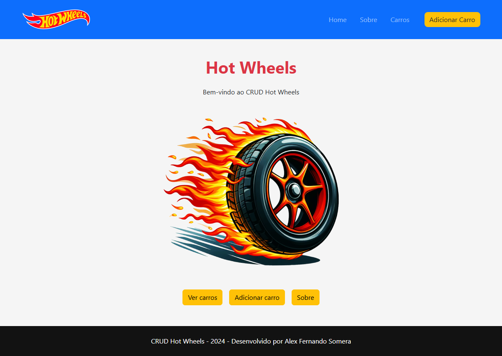

## Nome: `Alex Fernando Somera`

Para executar este projeto:

1. Entre pasta react-hotwheels no terminal:
```
cd react-hotwheels
```

2. Rode npm install para instalar as dependências do projeto:


```
npm install
```

3. E em seguida, npm start, para iniciar a execução do projeto.

```
npm start
```

Após execução do projeto, este é o resultado esperado no navegador:


Acessar [http://localhost:3000](http://localhost:3000) para visualizar a aplicação no browser.

## Introdução

Este projeto contém uma estrutura básica criada a partir do comando Create React App.

## Componentes

Os componentes estão no diretório `./src/components` e são os seguintes:

- About
    - Descrição: Página Com breve descrição sobre o proejto

- Anchor
    - Descrição: Componente de link.

- Button
    - Descrição: Componente de botão reutilizável, usado em várias partes da aplicação.

- CarForm
    - Descrição: Componente de formulário para adicionar um carro.

- CarsList
    - Descrição: Componente de listagem dos carros cadastrados e que permite excluir e editar um carro.

- Footer
    - Descrição: Componente de rodapé, exibindo informações do projeto e do desenvolvedor.

- FormItem
    - Descrição: Componente contendo um item de formulário composto pelo input e seu respectivo label.

- Header
    - Descrição: Componente de cabeçalho, contendo o logotipo e a navegação principal da aplicação.

- Home
    - Descrição: Página inicial da aplicação, exibindo informações a tela de boas-vindas e links para os principais recursos.

- Modal
    - Descrição: Componente de modal reutilizável, usado para exibir conteúdo em uma sobreposição na tela.

- Navbar
    - Descrição: Componente contendo os links de navegação da aplicação

- NotFound
    - Descrição: Página de erro 404, exibida quando um URL inválido é acessado.

## Conclusão

Este projeto é apenas para fins demonstrativos e seu objetivo é unicamente demostrar algumas funcionalidades úteis para o desenvolvimento de projetos em ReactJS.